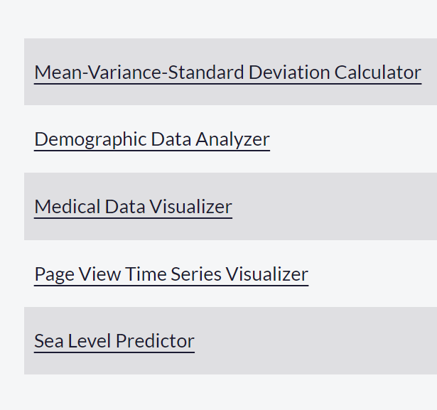
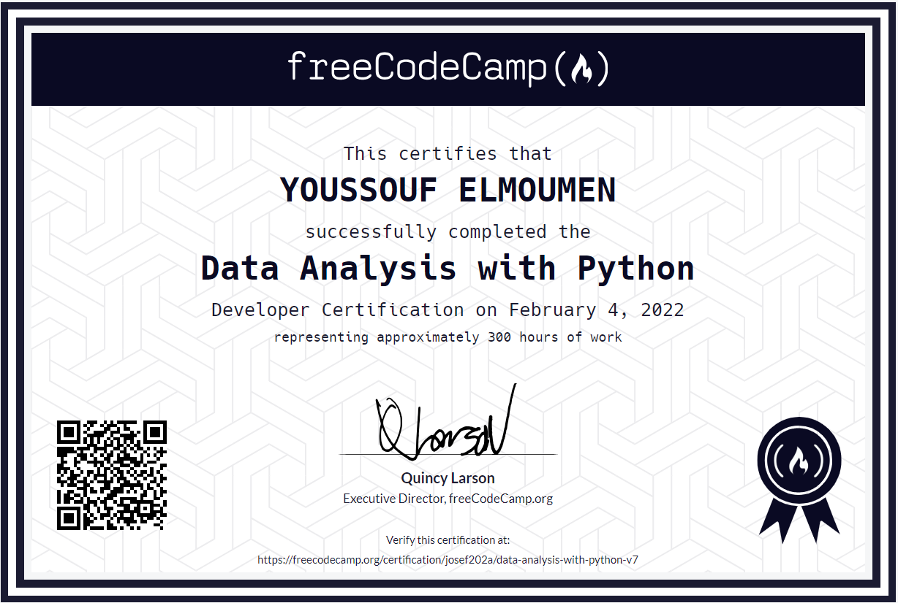

Data-Analysis-with-Python-freeCodeCamp 😎
=====================
-   [Course Link](https://www.freecodecamp.org/learn/data-analysis-with-python/)
-   [My Certificate](https://www.freecodecamp.org/certification/josef202a/data-analysis-with-python-v7)
## What is it?
Data Analysis with Python
In these comprehensive video courses, created by Santiago Basulto, you will learn the whole process of data analysis. You'll be reading data from multiple sources (CSV, SQL, Excel), process that data using NumPy and Pandas, and visualize it using Matplotlib and Seaborn, Additionally, we've included a thorough Jupyter Notebook course, and a quick Python reference to refresh your programming skills.

## Overview
The course notebooks and building these projects allowed me to obtain new skills and familiarize myself more with the Python's Data Analysis and visualization toolbox. I learned the whole process of Data Analysis: reading data from multiple sources (CSVs, SQL, Excel, etc), processing them using NumPy and Pandas, visualize them using Matplotlib and Seaborn and clean and process it to create reports.

## My 5 Data Analysis projects that I've built as part of my freeCodeCamp assignment.

These projects also allowed me to obtain my Data Analysis with Python Certification which is a Developer Certification, representing approximately 400 hours of coursework.

I finished this course on February 4, 2022.
The picture below shows my certificate after completing all the assignments:

